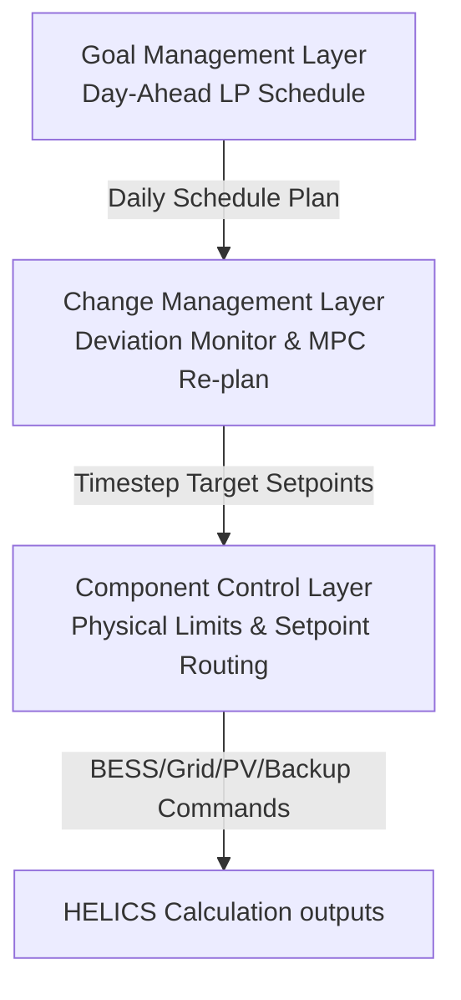

# Network Balancer (EMS) Calculation Service

The central Energy Management System (EMS) calculation service for the DOTS simulator. It uses a **3-Layer MAPE-K (Monitor-Analyze-Plan-Execute with Knowledge)** control loop to optimize power routing between the Electrical Grid, Battery Energy Storage (BESS), Local Photovoltaic (PV) Generation, and Backup Generators.

## Table of Contents
- [Overview](#overview)
- [3-Layer Control Architecture](#3-layer-control-architecture)
- [ESDL Tuning & Tuning KPIs](#esdl-tuning--tuning-kpis)
- [Calculations & HELICS Federation](#calculations--helics-federation)
- [Mandate-Aware PV Curtailment](#mandate-aware-pv-curtailment)
- [InfluxDB Metrics & Alarms](#influxdb-metrics--alarms)
- [Project Structure](#project-structure)
- [How to Build & Run](#how-to-build--run)

---

## Overview

The **Network Balancer Service** is the central intelligence of the DOTS microservices simulation. It is responsible for:
1. Routing power to meet the datacenter's real-time electricity demand.
2. Minimizing operating costs (based on EPEX SPOT prices) and grid carbon footprints.
3. Managing local battery charging/discharging setpoints safely.
4. Performing Model Predictive Control (MPC) replanning when real-time demand or battery SoC drifts from day-ahead plans.

The service logic is implemented in [networkbalancerservice.py](src/Networkbalancerservice/networkbalancerservice.py) and inherits from [NetworkbalancerserviceBase](src/Networkbalancerservice/networkbalancerservice_base.py).

---

## 3-Layer Control Architecture

The balancer uses a three-layer MAPE control architecture defined in [three_layer_mape](src/Networkbalancerservice/three_layer_mape):



1. **Goal Management Layer:** Executes once a day (via `day_ahead_routing`). It ingests 24-hour forecasts, models error perturbations using the [ForecastErrorModel](src/Networkbalancerservice/forecast_error.py), and solves a Linear Program (LP) using PuLP/CBC to establish a base schedule.
2. **Change Management Layer:** Executes during each 15-minute dispatch step. It monitors actual State of Charge (SoC) and demand. If the drift exceeds the ESDL threshold, it spawns a background thread to re-run the Model Predictive Control (MPC) optimization over the remaining horizon.
3. **Component Control Layer:** Executes setpoints at each step. It translates the target setpoint into physical command values, handles battery safety levels, routes remaining unserved load to backup generators, and computes PV curtailment limits.

---

## ESDL Tuning & Tuning KPIs

The service parses KPIs attached to the `ElectricityNetwork` asset in the Energy System Description Language (ESDL) topology:

| KPI Name | Default | Purpose |
| :--- | :--- | :--- |
| `w_unserved` | `1.0e9` | Penalty weight for unserved load (power outages). |
| `w_carbon` | `1.0` | Optimization weight for grid carbon minimization. |
| `w_price` | `0.0` | Optimization weight for grid price cost minimization. |
| `w_effort` | `0.01` | Penalty weight for rapid battery charge/discharge switching. |
| `w_soc_low` | `1.0e6` | Penalty weight for dropping battery SoC below baseline. |
| `soc_baseline` | `50.0` | Target battery SoC baseline percentage. |
| `mpc_soc_drift_threshold` | `5.0` | Maximum allowed SoC drift (%) before triggering MPC. |
| `mpc_demand_spike_threshold`| `0.10` | Maximum allowed demand deviation (%) before MPC. |
| `mpc_horizon_steps` | `24` | Forecast horizon length for MPC calculations. |
| `mpc_replan_cooldown` | `4` | Number of timesteps to wait between MPC trigger evaluations. |
| `enable_battery` | `True` | Disables battery usage (zeroes optimization limits). |
| `enable_backup_generator` | `True` | Enables backup generator dispatch during grid/BESS deficits. |
| `enable_renewable_service`| `True` | Integrates PV solar generation. |
| `enable_change_management`| `True` | Toggles real-time MPC replanning on deviations. |
| `enable_goal_management` | `True` | Toggles day-ahead optimization (falls back to flat baseline if false). |
| `enable_mandate` | `True` | Toggles mandatory grid surplus absorption. |

---

## Calculations & HELICS Federation

The calculations are specified in [input.json](input.json):

### 1. `day_ahead_routing`
- **Interval:** 86400 seconds (24h) | **Offset:** 2 seconds
- **Inputs:** `power_limit_plan_DA` (Grid), `mandated_min_power_draw_DA` (Grid), `carbon_intensity_plan_DA` (Grid), `electricity_price_plan_DA` (Grid), `demand_power_plan_da` (Datacenter), `planned_generation_DA` (Solar).
- **Action:** Spawns a background thread to generate the 24-hour daily plan.

### 2. `network_dispatch`
- **Interval:** 900 seconds (15m) | **Offset:** 10 seconds
- **Inputs:** `demand_power_w` (Datacenter), `state_of_charge` (Battery), `bess_power_w` (Battery), `actual_power_limit_ID` (Grid), `actual_carbon_intensity_ID` (Grid), `mandated_min_power_draw_ID` (Grid), `actual_electricity_price_ID` (Grid), `potential_available_generation_ID` (Solar), `backup_supplied_power` (Backup), `available_max_power` (Backup).
- **Outputs:**
  - `bess_allocation_w` (Unit: `W`): Setpoint for battery (+ discharge / - charge).
  - `grid_allocation_w` (Unit: `W`): Setpoint for grid import.
  - `current_max_power_limit` (Unit: `W`): Curtailment ceiling for the solar installation.
  - `backup_requested_power` (Unit: `W`): Dispatch command for backup generator.
  - `served_datacenter_power_w` (Unit: `W`): Realized power delivered to datacenter.

---

## Mandate-Aware PV Curtailment

When the grid publishes a positive min-load mandate (`mandated_min_power_draw_ID > 0`), it signals that the upstream transmission network has a generation surplus that the microgrid **must** absorb.

To force this grid surplus to be absorbed by the datacenter load and BESS charging, local PV generation must be curtailed. The balancer calculates a dynamic limit:
$$\text{PV Curtailment Limit} = \max(0.0, \text{Datacenter Demand} - \text{Mandated Grid Offtake})$$
If no surplus is present, the curtailment limit is set to a large sentinel value ($1.0 \times 10^9$ W) to allow unrestricted solar generation.

---

## InfluxDB Metrics & Alarms

The balancer logs a rich set of operational metrics grouped by ESDL network ID once per day (every 96 steps):
- **Real-Time Setpoints:** `Actual_SOC_from_Battery`, `Setpoint_from_Layers_kW`, `Routed_to_Grid_W`, `Routed_to_BESS_W`, `Backup_Requested_Power_W`, `served_datacenter_power_w`.
- **Cost & Carbon:** `Step_Cost_EUR`, `Total_Carbon_g`, `Cumulative_Cost_EUR`, `Cumulative_Carbon_g`, and counterfactual metrics (`Baseline_Step_Cost_EUR`, `Cumulative_Baseline_Cost_EUR`) to compute optimization savings.
- **Plans & Forecasts:** `Planned_SOC`, `Planned_BESS_Power_W`, `Forecasted_Grid_CI`, `Forecasted_DC_Demand_W`.
- **MAPE-K Diagnostic Alarms:** `SOC_Drift_pct`, `Demand_Delta_W`, `Demand_Spike_Flag`, `Unplanned_Outage_Flag`, `Triggered_Replan_Flag`, `Alarm_Active_Flag`.

---

## Project Structure

- [pyproject.toml](pyproject.toml): Package configuration.
- [Dockerfile](Dockerfile): Docker container script.
- [input.json](input.json): Calculation specs.
- **src/Networkbalancerservice/**
  - [networkbalancerservice.py](src/Networkbalancerservice/networkbalancerservice.py): Primary implementation.
  - [networkbalancerservice_base.py](src/Networkbalancerservice/networkbalancerservice_base.py): HELICS configuration base.
  - [forecast_error.py](src/Networkbalancerservice/forecast_error.py): Perturbation helper for robust LP.
  - [three_layer_mape/](src/Networkbalancerservice/three_layer_mape): Subpackage hosting MAPE layers.

---

## How to Build & Run

### Local Execution
```bash
python src/Networkbalancerservice/networkbalancerservice.py
```

### Docker Build
```bash
docker build -t network-balancer-service:latest .
```

---

## Thesis modifications (MSc, single grid-constrained data center)

This fork extends the base EMS for the thesis evaluation. Changes, all in `src/Networkbalancerservice/networkbalancerservice.py` and the MAPE-K layers:

- **Normalised objective weights.** The carbon and price terms in the day-ahead LP and the MPC are each divided by their horizon-mean (`CI / mean(CI)`, `price / mean(price)`), so `w_carbon : w_price` is a comparable influence ratio rather than a raw-unit one. Without this, `w_carbon = w_price = 1` behaved as roughly 3:1 carbon-favouring.
- **Scope-1 backup accounting.** Backup dispatch is now capacity-limited (nameplate read from the ESDL `GasProducer.power`, since the federate capacity subscription was removed for robustness) and charged on-site Scope-1 carbon (`backup_co2_factor`, default 600 gCO2/kWh) plus diesel fuel cost (`backup_cost_eur_per_kwh`, default 0.40 EUR/kWh). Cumulative carbon is logged as a Scope-2 / Scope-1 split whose sum is the headline figure.
- **Removed the phantom backup carbon.** The previous code added 600 gCO2/kWh to every unserved kWh whenever the backup asset was merely enabled, while that energy was still counted as unserved (a double-count). Unserved load now carries no carbon unless the generator actually serves it.
- **Two counterfactual baselines, each a full carbon/cost/unserved triple:**
  - `Cumulative_EqualService_*`: serves the same load the EMS served, naive timing, no battery. Isolates the carbon/cost value of dispatch timing.
  - `Cumulative_Passive_*`: same PV and grid limit, no battery, sheds the overflow. The "do nothing" deployment reference; its unserved gap to the EMS is the load the battery rescues.
- **New ESDL `DoubleKPI` tuning knobs** read from the `ElectricityNetwork` asset: `backup_co2_factor`, `backup_cost_eur_per_kwh`, `sim_seed`, in addition to the existing `w_*`, `soc_baseline`, `mpc_*`, and `forecast_*` knobs.
